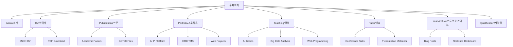

# 사이트 구조 및 페이지별 상세 분석

## 📊 전체 사이트 구조도



## 🏠 페이지별 상세 구조

### 1. 홈페이지 (About) - `/`

**파일**: `_pages/about.md`  
**레이아웃**: `single`  
**컴포넌트**: `author-profile`

#### 주요 섹션
- **개인 소개**: 학술 배경 및 전문 분야
- **현재 직책**: 한국직업능력개발센터장
- **연구 관심사**: AI, 교육공학, HRD
- **학술 여정**: 주요 마일스톤
- **연락처**: 이메일, GitHub, 소셜미디어

#### 특징
- 프로필 이미지 표시
- 소셜 링크 통합
- 최근 업데이트 하이라이트
- 반응형 레이아웃

---

### 2. 이력서 (CV) - `/cv/`

**파일**: `_pages/cv.md`, `_data/cv.json`  
**레이아웃**: `cv-layout`  
**스타일**: `_sass/layout/_json_cv.scss`

#### JSON 구조
```json
{
  "basics": {
    "name": "이애본",
    "label": "한국직업능력개발센터장",
    "email": "aebon@kyonggi.ac.kr",
    "location": {"city": "Seoul", "countryCode": "KR"}
  },
  "education": [...],
  "work": [...],
  "awards": [...],
  "publications": [...],
  "skills": [...],
  "projects": [...]
}
```

#### 섹션별 상세
1. **교육 (Education)**
   - 박사과정 (진행중): 경영학, 한신대학교
   - 석사: 컴퓨터교육, 경인교육대학교
   - 학사: 컴퓨터교육, 경인교육대학교

2. **경력 (Work Experience)**
   - 현재: 한국직업능력개발센터 센터장
   - 이전: 다양한 교육 기관 강의

3. **수상 (Awards)**
   - AICE Basic 수료
   - 각종 교육 프로그램 이수

---

### 3. 논문 (Publications) - `/publications/`

**디렉토리**: `_publications/`  
**레이아웃**: `single`  
**아카이브**: `archive`

#### 논문 목록
1. **2025년 예정**: Social Intelligence Research (JCCT)
2. **2022년**: Household Variables Impact Analysis (IJACT)  
3. **2012년**: RFID 기반 시각장애인 네비게이션 시스템 (석사논문)

#### 메타데이터 구조
```yaml
title: "논문 제목"
collection: publications
permalink: /publication/2025-social-intelligence
excerpt: '요약 내용'
date: 2025-03-31
venue: 'Journal Name'
paperurl: 'http://example.com/paper.pdf'
citation: 'Lee, A. (2025). "Paper Title." Journal Name. 1(1).'
```

---

### 4. 포트폴리오 (Portfolio) - `/portfolio/`

**디렉토리**: `_portfolio/`  
**레이아웃**: `single`  
**스타일**: 카드 기반 그리드

#### 주요 프로젝트

##### 4.1 AHP 의사결정 지원 플랫폼
```yaml
title: "AHP 의사결정 지원 플랫폼"
excerpt: "계층적 분석 과정을 활용한 다기준 의사결정 지원 시스템"
collection: portfolio
date: 2024-12-20
tags:
  - React
  - Django
  - AHP Algorithm
  - Decision Support
```

**기술 스택**:
- Frontend: React, TypeScript, Tailwind CSS
- Backend: Django, PostgreSQL
- 배포: Render, GitHub Pages
- 특징: 실시간 AHP 분석, 시각화, 보고서 생성

##### 4.2 HRD-TMS 시스템
```yaml
title: "HRD 훈련관리시스템"
excerpt: "교육 기관을 위한 종합 훈련 관리 솔루션"
collection: portfolio
date: 2023-06-15
tags:
  - Django
  - Bootstrap
  - MySQL
  - Education Management
```

**주요 기능**:
- 수강생 관리
- 강의 스케줄링
- 성적 관리
- 수료증 발급

---

### 5. 강의 (Teaching) - `/teaching/`

**디렉토리**: `_teaching/`  
**레이아웃**: `single`  
**정렬**: 최신순

#### 강의 과목

##### 5.1 AI 기초와 활용 (2025)
```yaml
title: "AI 기초와 활용"
collection: teaching
type: "정규과정"
permalink: /teaching/2025-ai-basics
venue: "한국직업능력개발센터"
date: 2025-01-01
location: "Seoul, Korea"
```

**강의 내용**:
- 인공지능 개념 및 역사
- 머신러닝 기초
- 실무 적용 사례
- 실습: Python, TensorFlow

##### 5.2 빅데이터 분석 (2024)
```yaml
title: "빅데이터 분석과 시각화"
collection: teaching
type: "단기과정"
venue: "한신대학교"
date: 2024-03-01
```

**커리큘럼**:
- 데이터 수집 및 전처리
- 통계 분석 기법
- 시각화 도구 활용
- 프로젝트 기반 학습

---

### 6. 발표 (Talks) - `/talks/`

**디렉토리**: `_talks/`  
**레이아웃**: `talk`  
**맵 시각화**: `talkmap.html`

#### 주요 발표

##### 6.1 2024 AI 컨퍼런스
```yaml
title: "교육 분야 AI 활용 전략"
collection: talks
type: "초청강연"
permalink: /talks/2024-ai-conference
venue: "서울 코엑스"
date: 2024-11-15
location: "Seoul, Korea"
```

##### 6.2 2022 TBT 대회 발표
```yaml
title: "AHP 기반 의사결정 모델"
collection: talks
type: "학술발표"
venue: "연세대학교"
date: 2022-09-01
```

---

### 7. 연도별 아카이브 (Year Archive) - `/year-archive/`

**파일**: `_pages/year-archive.html`  
**레이아웃**: `archive`  
**최근 업데이트**: 2025.11.22

#### 주요 기능
- **통계 대시보드**: 총 게시물, 활동 연도, 연구논문 수
- **연도별 그룹화**: 시간순 정리
- **카드 레이아웃**: 현대적 디자인
- **반응형**: 모바일 최적화

#### 스타일 구성요소
```css
.year-archive-intro { /* 소개 섹션 */ }
.stats-summary { /* 통계 카드 */ }
.archive__subtitle { /* 연도 헤더 */ }
.archive__item { /* 개별 포스트 */ }
```

---

### 8. 자격증 (Qualification) - `/qualification/`

**파일**: `_pages/qualification.md`  
**레이아웃**: `single`

#### 자격증 목록
1. **AICE Basic**: AI 교육 전문가 과정
2. **정보처리기사**: 정보처리 관련 자격
3. **기타 교육 관련 수료증**

---

## 🗂️ 파일 시스템 구조

### 디렉토리별 역할
```
aebonlee.github.io/
├── _config.yml              # Jekyll 메인 설정
├── _data/                   # 구조화된 데이터
│   ├── navigation.yml       # 메뉴 구성
│   ├── cv.json             # 이력서 데이터
│   ├── authors.yml         # 저자 정보
│   └── ui-text.yml         # UI 텍스트
├── _includes/              # 재사용 컴포넌트
│   ├── archive-single.html # 아카이브 항목
│   ├── author-profile.html # 프로필 사이드바
│   ├── cv-template.html    # CV 템플릿
│   ├── head.html          # HTML 헤드
│   ├── masthead.html      # 상단 네비게이션
│   └── sidebar.html       # 사이드바
├── _layouts/               # 페이지 레이아웃
│   ├── default.html       # 기본 레이아웃
│   ├── single.html        # 단일 페이지
│   ├── archive.html       # 아카이브 페이지
│   ├── cv-layout.html     # CV 전용 레이아웃
│   └── talk.html          # 발표 페이지
├── _pages/                 # 정적 페이지
├── _posts/                 # 블로그 포스트
├── _portfolio/            # 포트폴리오 항목
├── _publications/         # 논문 정보
├── _teaching/             # 강의 정보
├── _talks/                # 발표 자료
├── _sass/                 # SCSS 스타일시트
├── assets/                # 정적 자원
├── images/                # 이미지 파일
├── files/                 # 문서 파일 (PDF 등)
└── Dev_md/               # 개발 문서
```

## 🎯 네비게이션 시스템

### 메인 메뉴 구조
```yaml
# _data/navigation.yml
main:
  - title: "소개"
    url: /
  - title: "이력서"  
    url: /cv/
  - title: "논문"
    url: /publications/
  - title: "프로젝트"
    url: /portfolio/
  - title: "강의"
    url: /teaching/
  - title: "발표"
    url: /talks/
  - title: "블로그"
    url: /year-archive/
  - title: "자격증"
    url: /qualification/
```

### 사이드바 링크
- **이메일**: aebon@kyonggi.ac.kr
- **GitHub**: @aebonlee
- **위치**: Seoul, Korea
- **ORCID**: 연결 가능
- **Google Scholar**: 향후 추가 예정

## 📱 반응형 브레이크포인트

### CSS 미디어 쿼리
```scss
// _sass/layout/_base.scss
$small: 640px;
$medium: 768px;
$large: 1024px;
$x-large: 1280px;

@include breakpoint($small) { /* 모바일 */ }
@include breakpoint($medium) { /* 태블릿 */ }
@include breakpoint($large) { /* 데스크톱 */ }
```

## 🔍 SEO 최적화 구조

### 메타데이터 시스템
- **Open Graph**: 소셜 미디어 최적화
- **Schema.org**: 구조화된 데이터
- **Sitemap**: 자동 생성
- **RSS Feed**: Jekyll Feed 플러그인

### URL 구조
```
https://aebonlee.github.io/
├── /                     # 홈페이지
├── /cv/                  # 이력서
├── /publications/        # 논문 목록
├── /publication/[slug]   # 개별 논문
├── /portfolio/          # 포트폴리오 목록  
├── /portfolio/[slug]    # 개별 프로젝트
├── /teaching/           # 강의 목록
├── /teaching/[slug]     # 개별 강의
├── /talks/              # 발표 목록
├── /talks/[slug]        # 개별 발표
├── /year-archive/       # 연도별 아카이브
└── /qualification/      # 자격증
```

## 🎨 디자인 시스템 아키텍처

### 색상 시스템
```scss
:root {
  --primary-color: #0366d6;      // GitHub Blue
  --secondary-color: #586069;     // Gray
  --background-color: #ffffff;    // White
  --surface-color: #f6f8fa;      // Light Gray
  --border-color: #e1e4e8;       // Border Gray
  --text-color: #24292e;         // Dark Gray
  --text-secondary: #586069;     // Light Gray
}
```

### 타이포그래피 스케일
```scss
$type-size-1: 2.441em;  // h1
$type-size-2: 1.953em;  // h2
$type-size-3: 1.563em;  // h3
$type-size-4: 1.25em;   // h4
$type-size-5: 1em;      // h5
$type-size-6: 0.8em;    // h6
```

## 🚀 성능 최적화 전략

### 1. 이미지 최적화
- **형식**: WebP + 폴백
- **크기**: 적응형 이미지
- **로딩**: Lazy Loading

### 2. CSS 최적화
- **압축**: Sass 빌드 시 minify
- **Critical CSS**: 인라인 처리
- **변수 활용**: CSS Custom Properties

### 3. JavaScript 최소화
- **바닐라 JS**: jQuery 제거 고려
- **번들 크기**: 필요 기능만 로드
- **비동기 로딩**: 필요시에만

---

**문서 작성일**: 2025년 11월 22일  
**마지막 업데이트**: Year-Archive 페이지 재디자인 완료  
**다음 업데이트 예정**: 다국어 지원, 검색 기능